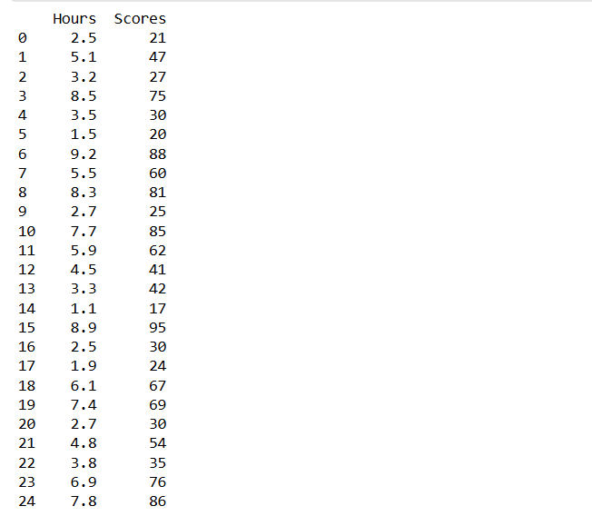
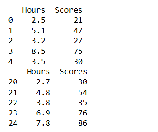
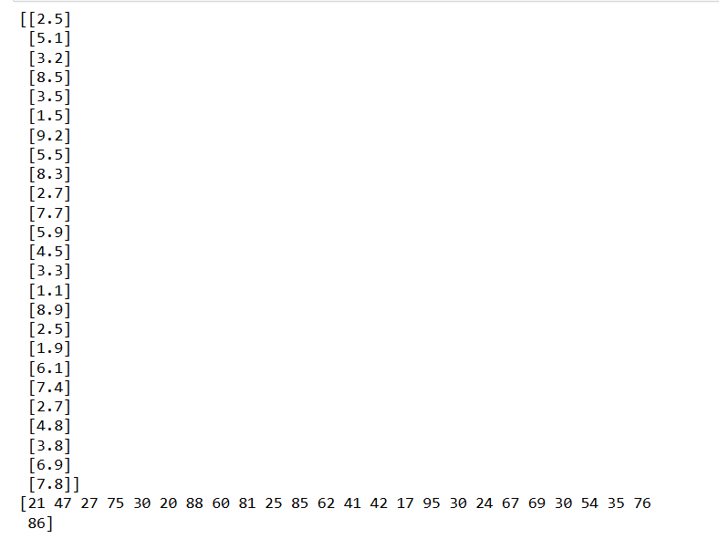
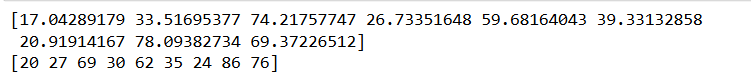
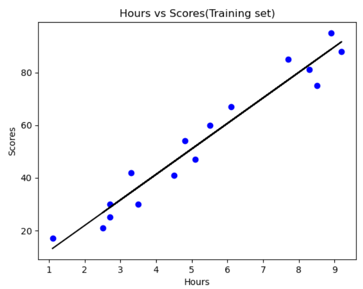
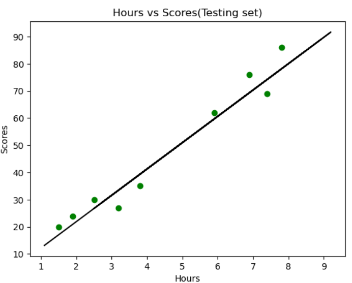
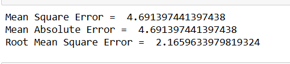

# Implementation-of-Simple-Linear-Regression-Model-for-Predicting-the-Marks-Scored

## AIM:
To write a program to predict the marks scored by a student using the simple linear regression model.

## Equipments Required:
1. Hardware – PCs
2. Anaconda – Python 3.7 Installation / Jupyter notebook

## Algorithm
1. Import the needed packages
2. Assigning hours to x and scores to y
3. Plot the scatter plot
4. Use Mse,Rmse,Mae formula to find the values

## Program:
```
# IMPORT REQUIRED PACKAGE
 import pandas as pd
 import numpy as np
 from sklearn.metrics import mean_absolute_error,mean_squared_error
 import matplotlib.pyplot as plt
 dataset=pd.read_csv("C:\\Users\\admin\\Downloads\\student_scores.csv")
 print(dataset)
 # READ CSV FILES
 dataset=pd.read_csv("C:\\Users\\admin\\Downloads\\student_scores.csv")
 print(dataset.head())
 print(dataset.tail())
 # COMPARE DATASET
 x=dataset.iloc[:,:-1].values
 print(x)
 y=dataset.iloc[:,1].values
 print(y)
 # PRINT PREDICTED VALUE
 from sklearn.model_selection import train_test_split
 x_train,x_test,y_train,y_test=train_test_split(x,y,test_size=1/3,random_sta
 from sklearn.linear_model import LinearRegression
 reg=LinearRegression()
 reg.fit(x_train,y_train)
 y_pred = reg.predict(x_test)
 print(y_pred)
 print(y_test)
 # GRAPH PLOT FOR TRAINING SET
 plt.scatter(x_train,y_train,color='blue')
 plt.plot(x_train,reg.predict(x_train),color='black')
 plt.title("Hours vs Scores(Training set)")
 plt.xlabel("Hours")
 plt.ylabel("Scores")
 plt.show()
 # GRAPH PLOT FOR TESTING SET
 plt.scatter(x_test,y_test,color='green')
 plt.plot(x_train,reg.predict(x_train),color='black')
 plt.title("Hours vs Scores(Testing set)")
 plt.xlabel("Hours")
 plt.ylabel("Scores")
 plt.show()
 # PRINT THE ERROR
 mse=mean_absolute_error(y_test,y_pred)
 print('Mean Square Error = ',mse)
 mae=mean_absolute_error(y_test,y_pred)
 print('Mean Absolute Error = ',mae)
 rmse=np.sqrt(mse)
 print("Root Mean Square Error = ",rmse

Developed by: PRAGATHI KUMAR
RegisterNumber:  212224230200

```

## Output:









## Result:
Thus the program to implement the simple linear regression model for predicting the marks scored is written and verified using python programming.
